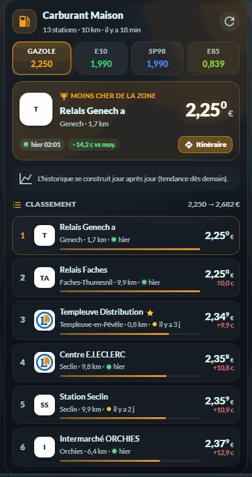
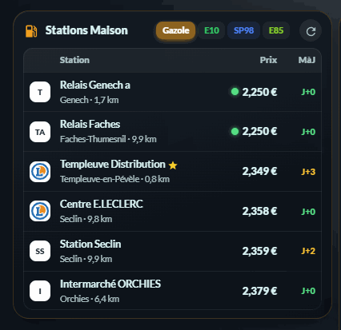
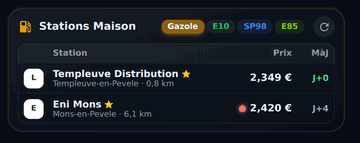

# ⛽ Carburant HOLM

[](https://hacs.xyz/)


Intégration **Home Assistant** qui suit les **prix des carburants en France** autour de chez vous — ou autour de n'importe quelle ville —
avec le **meilleur prix de la zone**, la **tendance**, vos **stations favorites** et une **carte Lovelace** moderne fournie avec l'intégration.

Données officielles : flux instantané v2 du Ministère de l'Économie ([data.economie.gouv.fr](https://data.economie.gouv.fr/explore/dataset/prix-des-carburants-en-france-flux-instantane-v2/)).

| Carte complète | Carte compacte | Compacte · favorites |
|---|---|---|
|  |  |  |

---

## Sommaire

- [Pourquoi cette intégration ?](#pourquoi-cette-intégration-)
- [Installation](#installation)
- [Configuration](#configuration)
- [Modifier une zone (options)](#modifier-une-zone-options)
- [Entités créées](#entités-créées)
- [La carte `holm-fuel-card`](#la-carte-holm-fuel-card)
- [Exemples d'automatisations](#exemples-dautomatisations)
- [Exemples de templates](#exemples-de-templates)
- [API WebSocket](#api-websocket)
- [Comment sont calculés les prix ?](#comment-sont-calculés-les-prix-)
- [FAQ / dépannage](#faq--dépannage)
- [Crédits & licence](#crédits--licence)

---

## Pourquoi cette intégration ?

| Besoin | Carburant HOLM |
|---|---|
| Choisir ses stations facilement | L'assistant **liste toutes les stations de la zone** (triées par distance, avec leurs prix actuels) : on coche ses favorites. |
| Une zone autour d'une autre ville | Tapez une **ville ou un code postal**, puis ajustez **le point et le rayon sur une carte** (1 à 50 km). Plusieurs zones possibles (Maison, Travail, Vacances…). |
| Savoir où c'est le moins cher | Un capteur **« Meilleur prix »** par carburant : station, distance, écart à la moyenne, top 5. |
| Voir l'évolution | **Historique 120 jours** (meilleur prix & moyenne de la zone, prix des favorites) et **tendance 1 j / 7 j**. |
| Ne pas se faire piéger par des prix périmés | Les prix plus vieux que *N* jours (réglable) sont **ignorés** dans le classement. |
| Un bel affichage sans configuration | La carte **`holm-fuel-card`** est **servie et enregistrée automatiquement** par l'intégration (vue complète ou compacte). |

Carburants gérés : **Gazole, E10 (SP95-E10), SP98, SP95, E85, GPLc**.

---

## Installation

### Via HACS (recommandé)

1. HACS → menu **⋮** → **Dépôts personnalisés**.
2. Dépôt : `https://github.com/kaaribou/carburant-holm` — Type : **Intégration** → **Ajouter**.
3. Recherchez **Carburant HOLM** → **Télécharger**.
4. **Redémarrez** Home Assistant.

Les nouvelles versions apparaissent ensuite dans **Paramètres → Mises à jour**.

### Manuelle

Copiez le dossier `custom_components/carburant_holm` dans `/config/custom_components/`, puis redémarrez Home Assistant.

> La carte `holm-fuel-card` est incluse : **aucune ressource Lovelace à ajouter**, l'intégration l'enregistre elle-même (et met à jour son numéro de version à chaque mise à jour).

---

## Configuration

**Paramètres → Appareils et services → Ajouter une intégration → Carburant HOLM.**

| Étape | Ce que vous faites |
|---|---|
| 1. Zone | Donnez un **nom** (ex. *Maison*, *Travail*). Laissez **Ville** vide pour centrer sur votre domicile, ou tapez une **ville / un code postal**. |
| 2. Commune | Si plusieurs communes correspondent, choisissez la bonne (recherche via geo.api.gouv.fr). |
| 3. Carte | **Déplacez le point** et **ajustez le cercle** : toutes les stations dans ce rayon sont comparées. Choisissez les **carburants**, l'**âge maximum d'un prix** (défaut 7 jours) et la **fréquence d'actualisation** (10 min à 24 h, défaut 30 min). |
| 4. Favorites | Cochez vos stations habituelles dans la liste (nom, ville, distance et prix actuels affichés). |

Vous pouvez créer **autant de zones que vous voulez** : chaque zone est une entrée indépendante avec ses capteurs.

### Paramètres

| Paramètre | Défaut | Rôle |
|---|---|---|
| Nom de la zone | *Maison* ou nom de la commune | Nom de l'appareil et des entités (« Carburant Maison »). |
| Centre & rayon | Domicile, 10 km | Zone de comparaison (1 à 50 km). |
| Carburants suivis | Gazole, E10, SP98, E85 | Un jeu de capteurs par carburant. |
| Ignorer les prix plus vieux que | 7 jours | Un prix non mis à jour depuis plus longtemps n'entre pas dans le meilleur prix / la moyenne. |
| Actualisation | 30 min | Fréquence d'interrogation de l'API (les stations publient en général plusieurs fois par jour). |
| Stations favorites | — | Stations avec capteurs dédiés et historique, même hors de la zone. |

---

## Modifier une zone (options)

**Paramètres → Appareils et services → Carburant HOLM → Configurer** :

1. Renommer la zone et/ou taper une **nouvelle ville** pour la recentrer (laisser vide = garder le centre actuel) ;
2. Ajuster le **point / rayon**, les **carburants**, l'âge max et l'actualisation ;
3. Mettre à jour les **favorites**.

L'intégration se recharge automatiquement.

---

## Entités créées

Chaque zone crée un appareil **« Carburant *Nom* »** et, pour chaque favorite, un appareil **station** rattaché à la zone.

### Par carburant (zone)

| Entité | État | Principaux attributs |
|---|---|---|
| `sensor.carburant_<zone>_meilleur_prix_<carburant>` | Prix le plus bas de la zone (€/L) | `station`, `brand`, `address`, `city`, `distance_km`, `latitude`, `longitude`, `updated`, `average`, `max`, `stations_count`, `trend_1d`, `trend_7d`, `top` (5 moins chères), image = logo de l'enseigne |
| `sensor.carburant_<zone>_prix_moyen_<carburant>` | Prix moyen de la zone (€/L) | `stations_count`, `max` |

### Par station favorite et par carburant

| Entité | État | Principaux attributs |
|---|---|---|
| `sensor.<station>_<carburant>` | Prix à la pompe (€/L) | `station`, `brand`, `address`, `city`, `distance_km`, `updated`, `days_since_update`, `shortage` (rupture), `rank` (rang dans la zone), `stations_count`, `delta_vs_best`, `delta_vs_average` |

### Autres

| Entité | Rôle |
|---|---|
| `button.carburant_<zone>_actualiser_les_prix` | Force une actualisation immédiate. |

Toutes les valeurs de prix ont `state_class: measurement` : elles alimentent les **statistiques long terme** de Home Assistant (graphiques natifs, carte *statistics-graph*, etc.).

> Les entity_id exacts dépendent du nom de la zone et des stations ; retrouvez-les dans l'appareil de la zone.

---

## La carte `holm-fuel-card`

Ajoutez une carte → cherchez **« HOLM Carburant »**. Tout se règle dans l'éditeur visuel ; aucune entité à choisir, la carte lit directement les données de la zone.

### Vue complète

- **Onglets carburants** avec le meilleur prix de chacun ;
- **Station la moins chère** : logo, nom, ville, distance, prix, ancienneté du prix, **tendance sur 7 jours**, **écart à la moyenne**, bouton **Itinéraire** ;
- **Courbe** meilleur prix / moyenne de la zone (jusqu'à 45 jours) ;
- **Classement** avec barre relative, écart au premier, fraîcheur du prix (● vert < 48 h, ● orange ≤ 3 j, ● gris au-delà), ruptures ;
- **Vos favorites** épinglées (★) même hors du top ;
- **Toucher une station** : adresse, **tous ses carburants**, services (lavage, boutique, gonflage, DAB…), automate 24/24, liens **Google Maps** et **Waze** ;
- Bouton **↻** d'actualisation.

### Vue compacte

Tableau façon « liste de stations » : logo · nom (ville, distance) · prix · **MàJ en J+n**, pastille ● verte sur la moins chère et ● rouge sur la plus chère, boutons carburants et **↻**. Toucher une ligne ouvre l'itinéraire. Option *uniquement mes favorites*.

### Options

| Option | YAML | Défaut | Description |
|---|---|---|---|
| Zone | `entry_id` | première zone | Zone à afficher (si vous en avez plusieurs). |
| Présentation | `layout` | `full` | `full` (complète) ou `compact`. |
| Titre | `title` | « Carburant *zone* » / « Stations *zone* » | Titre personnalisé. |
| Carburant par défaut | `fuel` | premier suivi | `gazole`, `e10`, `sp98`, `sp95`, `e85`, `gplc`. |
| Onglets | `fuels` | tous | Liste des carburants proposés dans la carte. |
| Lignes | `rows` | `6` | Nombre de stations du classement. |
| Courbe | `show_chart` | `true` | Affiche la tendance (vue complète). |
| Favorites | `show_favorites` | `true` | Ajoute vos favorites hors du top. |
| Uniquement favorites | `favorites_only` | `false` | Vue compacte limitée à vos favorites. |

```yaml
# Vue complète, gazole par défaut, 8 stations
type: custom:holm-fuel-card
fuel: gazole
rows: 8

# Vue compacte limitée à mes stations, onglets E10 et SP98
type: custom:holm-fuel-card
layout: compact
favorites_only: true
fuels: [e10, sp98]
title: Mes stations
```

---

## Exemples d'automatisations

**Alerte quand le gazole passe sous un seuil**

```yaml
alias: Gazole pas cher
triggers:
  - trigger: numeric_state
    entity_id: sensor.carburant_maison_meilleur_prix_gazole
    below: 1.70
actions:
  - action: notify.mobile_app_mon_telephone
    data:
      title: "⛽ Gazole à {{ states('sensor.carburant_maison_meilleur_prix_gazole') }} €"
      message: >
        {{ state_attr('sensor.carburant_maison_meilleur_prix_gazole', 'station') }}
        ({{ state_attr('sensor.carburant_maison_meilleur_prix_gazole', 'city') }},
        {{ state_attr('sensor.carburant_maison_meilleur_prix_gazole', 'distance_km') }} km)
```

**Prévenir quand la station la moins chère change**

```yaml
alias: Nouvelle station la moins chère (E10)
triggers:
  - trigger: state
    entity_id: sensor.carburant_maison_meilleur_prix_e10
    attribute: station_id
actions:
  - action: notify.mobile_app_mon_telephone
    data:
      message: >
        Le moins cher en E10 est maintenant {{ state_attr(trigger.entity_id, 'station') }}
        à {{ states(trigger.entity_id) }} €.
```

**Hausse marquée sur 7 jours**

```yaml
alias: Hausse du SP98
triggers:
  - trigger: template
    value_template: "{{ (state_attr('sensor.carburant_maison_meilleur_prix_sp98', 'trend_7d') or 0) > 0.05 }}"
actions:
  - action: notify.mobile_app_mon_telephone
    data:
      message: "Le SP98 a pris plus de 5 centimes en une semaine : faites le plein bientôt."
```

**Rappel du vendredi : où faire le plein ?**

```yaml
alias: Plein du week-end
triggers:
  - trigger: time
    at: "17:00:00"
conditions:
  - condition: time
    weekday: [fri]
actions:
  - action: notify.mobile_app_mon_telephone
    data:
      message: >
        
        Top E10 : {{ t.name }} {{ t.price }} €{{ ', ' if not loop.last }}
```

---

## Exemples de templates

```jinja
{# Économie sur un plein de 50 L en allant à la station la moins chère plutôt qu'à ma favorite #}
{{ ((states('sensor.templeuve_distribution_e10') | float - states('sensor.carburant_maison_meilleur_prix_e10') | float) * 50) | round(2) }} €

{# Rang de ma station #}
{{ state_attr('sensor.templeuve_distribution_e10', 'rank') }} / {{ state_attr('sensor.templeuve_distribution_e10', 'stations_count') }}
```

---

## API WebSocket

La carte utilise la commande `carburant_holm/data`, disponible pour vos propres cartes / scripts :

```json
{ "type": "carburant_holm/data", "entry_id": "optionnel", "history_days": 60 }
```

Réponse : `version` et `zones[]` avec pour chaque zone `entry_id`, `title`, `zone`, `center`, `radius`, `fuels`, `favorites`, `max_age_days`, `updated`, `stations[]` (id, nom, enseigne, logo, adresse, coordonnées, distance, carburants avec prix / date / rang / rupture, services, automate 24/24), `stats` (par carburant : meilleur, moyenne, max, classement, tendances), `history` (par carburant : `date`, `min`, `avg`) et `favorites_history`.

---

## Comment sont calculés les prix ?

- **Source** : API Opendatasoft du flux instantané v2 (mis à jour en continu par les stations). Requête géographique `distance(geom, POINT, rayon)` + stations favorites par identifiant.
- **Meilleur prix** : le plus bas parmi les stations **de la zone** dont le prix a moins de *N* jours ; en cas d'égalité, la plus proche l'emporte.
- **Moyenne / max** : sur les mêmes prix récents.
- **Historique** : une valeur par jour (dernier relevé du jour) conservée **120 jours** dans le stockage de Home Assistant.
- **Tendance** : différence du meilleur prix entre aujourd'hui et il y a 1 / 7 jours.
- **Noms & logos** : le flux officiel ne donne ni le nom ni l'enseigne ; ils proviennent de la liste communautaire du projet [hass-prixcarburant](https://github.com/Aohzan/hass-prixcarburant) (téléchargée et mise en cache chaque semaine). Sinon : « Station *ville* ».

---

## FAQ / dépannage

| Symptôme | Solution |
|---|---|
| *« Le flux de configuration n'a pas pu être chargé »* | Redémarrez Home Assistant après l'installation ; consultez les journaux (`custom_components.carburant_holm`). |
| La courbe dit « l'historique se construit » | Normal les premiers jours : 1 point par jour. La tendance 1 j apparaît le lendemain, celle à 7 j au bout d'une semaine. |
| Une station n'a pas de nom | Elle est absente de la liste communautaire : elle apparaît comme « Station *ville* ». |
| Un prix semble ancien | Voir l'attribut `updated` / la colonne *MàJ* ; baissez l'âge max dans les options pour l'exclure du classement. |
| La carte ne se met pas à jour après une mise à jour | Rechargez la page sans cache (Ctrl + F5) ou videz le cache du frontend dans l'application mobile. |
| Trop / pas assez de stations | Ajustez le rayon (options). Au-delà de 400 stations, seules les 400 premières sont chargées. |

Journal détaillé :

```yaml
logger:
  logs:
    custom_components.carburant_holm: debug
```

---

## Crédits & licence

- Données : **Ministère de l'Économie** — *Prix des carburants en France, flux instantané v2* — Licence Ouverte / Etalab 2.0.
- Communes : **geo.api.gouv.fr**.
- Noms & logos des stations : projet communautaire [Aohzan/hass-prixcarburant](https://github.com/Aohzan/hass-prixcarburant).
- Code : licence **MIT** — © kaaribou.

Voir le [CHANGELOG](CHANGELOG.md).
